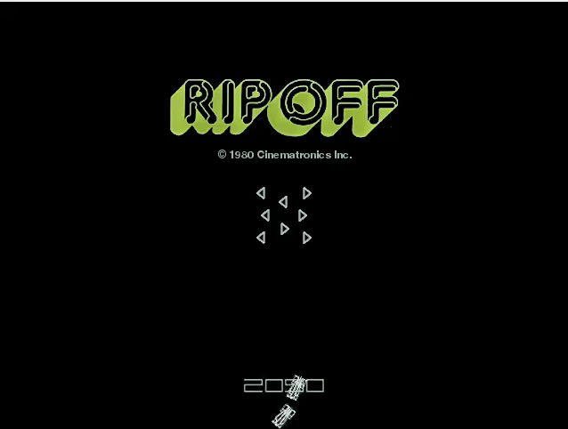
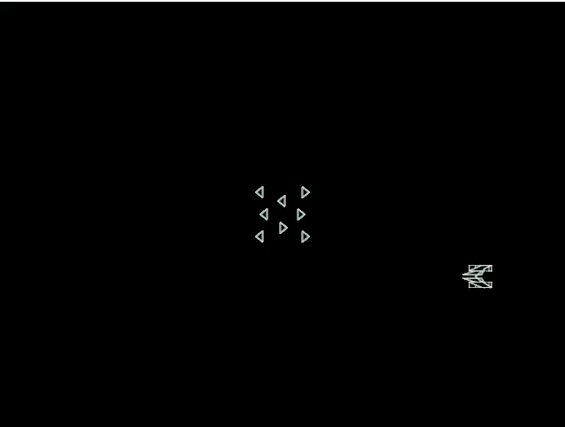

**PyRipOff**
===================
Clone of the 1980s Cinematronics **Rip Off** arcade game. Written by as a **Python/Pygame** development exercise. To date, tested on Windows and Ubuntu platforms.

**SCREENSHOTS:**
<table>
 <tr>
  <td></td>
  <td></td>
 </tr>
</table>

**REQUIREMENTS:**
Before running the game, make sure you have [Python v3.6](http://www.python.org/download/) installed. You will also need to install [Pygame v1.9.1](http://www.pygame.org/download.shtml), as the game will not run without it.

From the command line: python pyripoff.py

> **NOTE:** This game has not been tested with Python 2.x

**GAME PLAY:**
Protect the fuel canisters from invading pirate tanks. Use the **ARROW** key(s) to navigate the player tank. Press the **SPACEBAR** to fire player's cannon. Pirate tanks can be destroyed by shooting or colliding with them. Game is over when all fuel canister have been "ripped off".

<table>
 <tr>
  <th align="left">Game Controls</th>
  <th align="left">Player/Cannon</th>
 </tr>
 <tr>
  <td><kbd>&larr;</kbd> LEFT ARROW</td>
  <td>Rotate the player tank counterclockwise</td>
 </tr>
  <tr>
  <td><kbd>&rarr;</kbd> RIGHT ARROW</td>
  <td>Rotate the player tank clockwise</td>
 </tr>
  <tr>
  <td><kbd>&uarr;</kbd> UP ARROW</td>
  <td>Move the player forward</td>
 </tr>
  <tr>
  <td><kbd>SPACEBAR</kbd></td>
  <td>Fire player cannon</td>
 </tr>
</table>

> **Miscellaneous:**
> 
> - Game is organized into waves and bonus levels, there are six styles of pirate tanks to a wave.
> - A wave ends when all pirate tanks have been destroyed or have dragged a fuel canister off screen.
> - The bonus level increases after each wave.

**Have fun!**
Critiques regarding game play, bugs, glitches are most welcome.

-----------------------------------------------------------------------------
**TODO:**
 
1. Make standalone executable.
1. Add joystick control.
1. Add sound.
1. Add short-range lasers to pirate tanks
1. Game speed and difficulty increase with successive waves.
1. Improve pirate tanks AI.
1. Two player network capability.

#### References
1. https://en.wikipedia.org/wiki/Rip-Off
1. https://www.arcade-museum.com/game_detail.php?game_id=9326
1. http://www.red3d.com/cwr/boids/RipOff_Flocking.html
